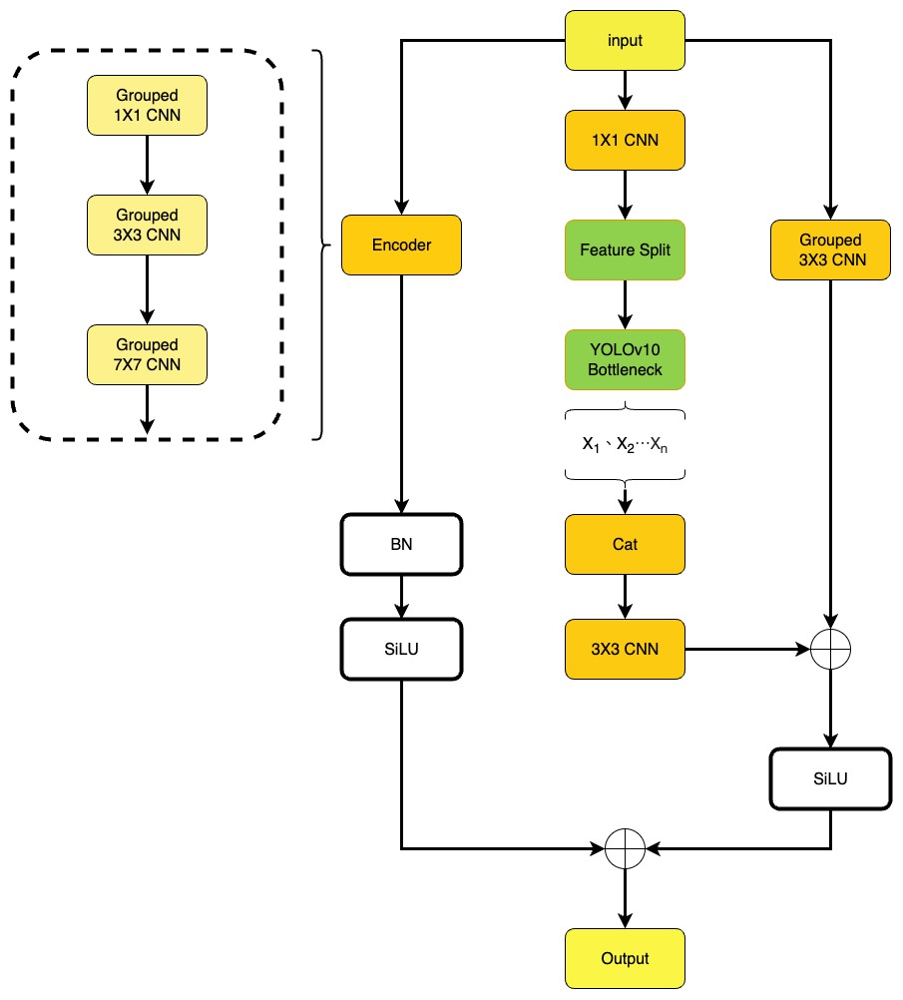
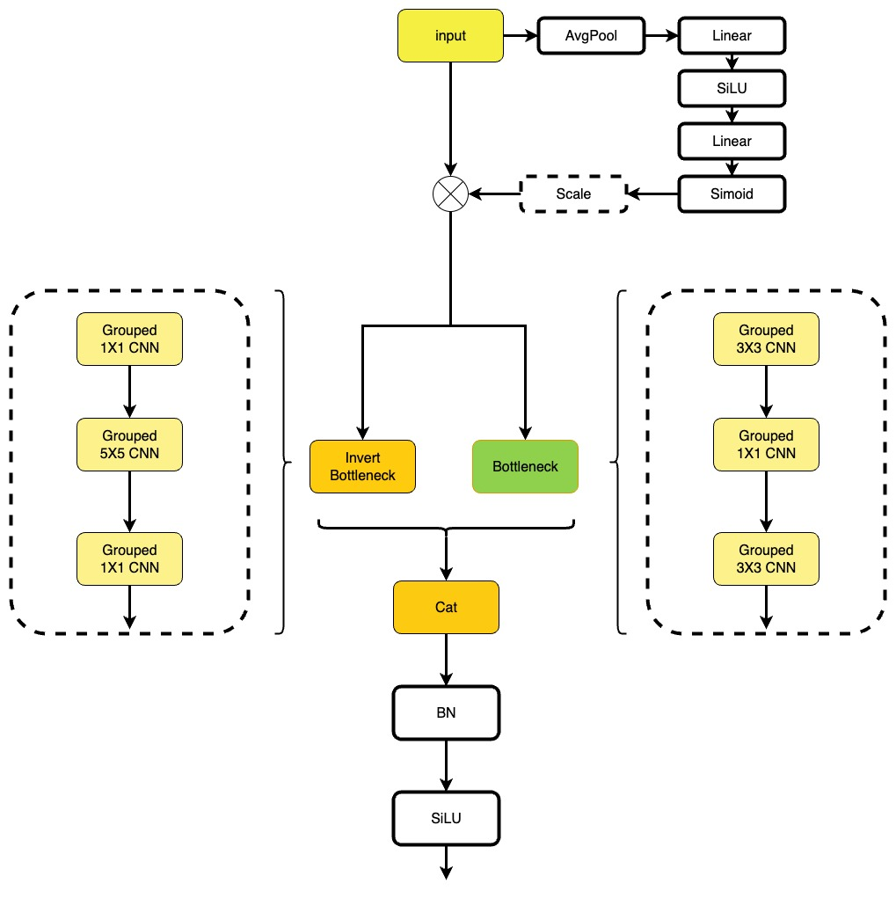
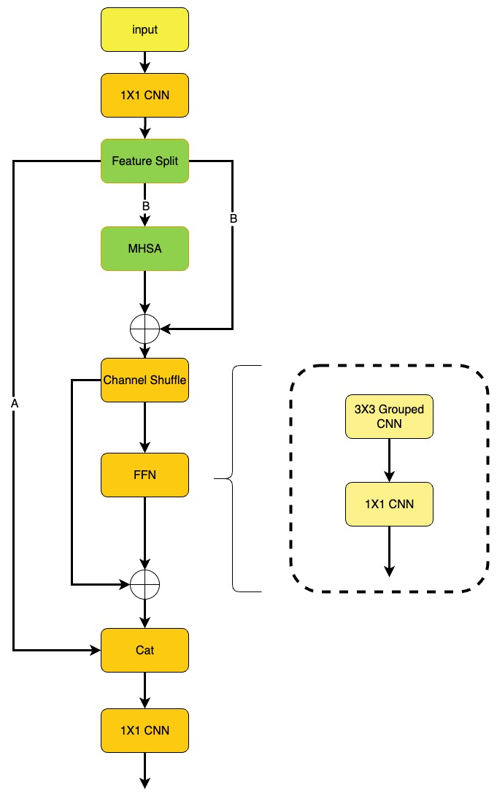

# YOLOv10-NQ


YOLOv10-NQ 是以 YOLOv10-n 為基準的輕量化物件偵測模型，面向中小型智慧船舶與資源受限的邊緣運算裝置。模型以 DGC2F、SGMB 與 SPSA 取代部分原始骨幹模組，在降低參數量與計算成本的同時，保留即時船舶辨識所需的多尺度特徵與注意力建模能力。

```text
Image -> YOLOv10-NQ Backbone -> Multi-scale Features -> YOLOv10 Detect Head -> Bounding Boxes + Classes + Scores
```

當前版本使用 640 × 640 輸入；模型規模為 1.6M parameters、6.1 GFLOPs，並在 20 類、15,100 張影像的自建船舶資料集進行驗證。

<details>
<summary><em>當前限制 / Current Limitations</em></summary>

儲存庫未包含訓練完成的權重與完整資料集。`data_cfg/dataset.yaml`、`train.py` 與 `val.py` 保留原開發環境的 Windows 絕對路徑，執行前必須改為本機路徑。船舶資料集仍有類別不平衡問題，部分特種船舶樣本不足；目前亦未提供特定邊緣硬體上的延遲、功耗或量化後效能測試。

---

The repository does not include trained weights or the complete dataset. Paths in `data_cfg/dataset.yaml`, `train.py`, and `val.py` reflect the original Windows environment and must be updated before use. The vessel dataset remains class-imbalanced, especially for uncommon vessel types. Hardware-specific latency, power consumption, and quantized deployment results have not yet been established.

</details>

---

## 簡介

全球貿易高度依賴海運。智慧船舶需要即時感知周遭船隻，但中小型平台通常無法配置高階運算設備，因此模型的參數量、浮點運算量與辨識能力必須共同納入設計。

本專案沿用 YOLOv10 的端到端偵測流程，集中修改 Backbone，保留三尺度偵測頭。三個輕量化模組分別處理多尺度卷積、通道選擇與部分自注意力的計算成本。

### 模型結構


> [!NOTE]
> 左側為 YOLOv10-NQ，右側為 YOLOv10-n。YOLOv10-NQ 以 DGC2F、SGMB 與 SPSA 替換 Backbone 中的部分 C2f 與 PSA 模組；Neck 與 YOLOv10 Detect Head 維持多尺度特徵融合與輸出。

| 論文模組 | 程式識別字 | 位置 | 用途 |
|---|---|---|---|
| `DGC2F` | `DGC2f` | `ultralytics/nn/modules/block.py` | 以分組卷積與多尺度卷積路徑降低 C2f 的特徵傳遞成本 |
| `SGMB` | `Depwise` | `ultralytics/nn/modules/conv.py` | 以通道門控及雙分支瓶頸強化關鍵特徵 |
| `SPSA` | `SDPSA` | `ultralytics/nn/modules/block.py` | 對部分通道執行注意力、Channel Shuffle 與輕量 FFN |

主要模型設定為 [`ultralytics/cfg/models/v10/yolov10nq2.yaml`](ultralytics/cfg/models/v10/yolov10nq2.yaml)。`yolov10nq.yaml` 為較早期的實驗設定。

### 實驗數據

#### Microsoft COCO 消融實驗

依序將 SGMB、DGC2F 與 SPSA 導入 YOLOv10-n Backbone並驗證其效能。

| 模型 | Recall | mAP50 | mAP50-95 | Parameters |
|---|---:|---:|---:|---:|
| SGMB | 0.38 | 0.41 | 0.28 | 1.5M |
| SGMB + DGC2F | 0.40 | 0.42 | 0.29 | 1.5M |
| SGMB + DGC2F + SPSA | 0.40 | 0.43 | 0.29 | 1.6M |
| YOLOv10-n | 0.44 | 0.47 | 0.33 | 2.3M |

完整 YOLOv10-NQ 相較 YOLOv10-n 減少約 30% 參數量。

#### 自建船舶資料集

| 模型 | Precision | Recall | mAP50 | mAP50-95 |
|---|---:|---:|---:|---:|
| YOLOv10-n | 0.88 | 0.81 | 0.92 | 0.61 |
| YOLOv11-n | 0.84 | 0.82 | 0.86 | 0.62 |
| YOLOv12-n | 0.90 | 0.82 | 0.92 | 0.62 |
| **YOLOv10-NQ** | **0.92** | 0.80 | 0.91 | 0.61 |

> [!NOTE]
> 船舶資料集包含 20 類、15,100 張於高雄港周邊蒐集的影像。部分稀有類別樣本不足，結果仍受類別不平衡影響。

---

## 輕量化模組

### DGC2F



DGC2F（Depthwise Group Coordinates-to-Features）以分組卷積建立多條特徵路徑，結合 Bottleneck 與反向瓶頸結構。不同 kernel size 擷取多尺度空間資訊，最後以殘差相加融合輸出。

| 設計 | 說明 |
|---|---|
| 多尺度卷積 | 透過 1 × 1、3 × 3 與 7 × 7 卷積擴展感受野 |
| Group Convolution | 限制跨通道運算量，降低參數與 FLOPs |
| 雙路徑融合 | 結合 C2f 類型的 Bottleneck 與反向瓶頸特徵 |
| 殘差輸出 | 以相加方式保留輸入與不同卷積路徑的資訊 |

### SGMB



SGMB（Squeeze-Gated Multi-Branch）先以 Global Average Pooling 產生通道權重，再將加權特徵送入一般瓶頸與反向瓶頸兩個分支。兩路特徵串接後經 Batch Normalization 與 SiLU 輸出。

| 設計 | 說明 |
|---|---|
| Squeeze Gate | 由全域特徵產生通道縮放係數，抑制冗餘資訊 |
| Multi-Branch | 以不同卷積組合擷取互補特徵 |
| Grouped Convolution | 降低各分支的卷積成本 |
| Feature Concatenation | 串接雙分支輸出，保留不同尺度的表示 |

### SPSA



SPSA（Shuffle Partial Self-Attention）只對部分通道執行 Multi-Head Self-Attention，再透過 Channel Shuffle 交換群組資訊；FFN 使用 3 × 3 Grouped Convolution 與 1 × 1 Convolution，以較低成本保留跨區域建模能力。

| 設計 | 說明 |
|---|---|
| Partial Attention | 僅在分割後的部分通道執行注意力 |
| Channel Shuffle | 促進不同通道群組之間的資訊交換 |
| Lightweight FFN | 以 Grouped Convolution 取代較高成本的全通道運算 |
| Residual Fusion | 分別保留 Attention 與 FFN 的殘差連接 |

---

## 專案結構

```text
YOLOv10-NQ/
├── ultralytics/
│   ├── cfg/models/v10/
│   │   ├── yolov10nq2.yaml     # 主要 YOLOv10-NQ 架構
│   │   ├── yolov10nq.yaml      # 早期實驗架構
│   │   └── yolov10n.yaml       # YOLOv10-n 基準架構
│   └── nn/
│       ├── modules/block.py    # DGC2f、SDPSA
│       ├── modules/conv.py     # Depwise／SGMB
│       └── tasks.py            # YAML 模組解析與模型建構
├── data_cfg/
│   └── dataset.yaml            # 船舶資料集設定
├── pic/                        # README 架構圖
├── train.py                    # 研究期間的訓練入口
├── val.py                      # 研究期間的驗證入口
├── app.py                      # Gradio 範例介面
├── requirements.txt
├── pyproject.toml
└── LICENSE
```

---

## 安裝

### 1. 下載專案

```bash
git clone https://github.com/ImChouOWO/YOLOv10-NQ.git
cd YOLOv10-NQ
```

### 2. 建立虛擬環境

專案的 `pyproject.toml` 支援 Python 3.8 以上版本。

Linux / macOS：

```bash
python3 -m venv .venv
source .venv/bin/activate
python3 -m pip install --upgrade pip
```

Windows PowerShell：

```powershell
python -m venv .venv
.venv\Scripts\Activate.ps1
python -m pip install --upgrade pip
```

### 3. 安裝專案

```bash
python -m pip install -r requirements.txt
python -m pip install -e .
```

`requirements.txt` 固定研究環境使用的 PyTorch、TorchVision、ONNX Runtime 與 Gradio 等版本。若使用不同 CUDA 版本或邊緣平台，請先依硬體環境安裝相容的 PyTorch，再安裝其餘相依套件。

---

## 資料集格式

本專案使用 Ultralytics YOLO Detection 格式。影像與標記檔需使用相同檔名，每個物件以一行表示。

```text
datasets/ships/
├── images/
│   ├── train/
│   └── val/
└── labels/
    ├── train/
    └── val/
```

```text
datasets/ships/images/train/000001.jpg
datasets/ships/labels/train/000001.txt
```

標記格式：

```text
class_id x_center y_center width height
```

座標均需依影像寬高正規化至 0 到 1。以下代表類別 `0` 的一個物件：

```text
0 0.5125 0.4833 0.2250 0.1667
```

請修改 [`data_cfg/dataset.yaml`](data_cfg/dataset.yaml)，將資料路徑換成自己的環境：

```yaml
path: /path/to/datasets/ships
train: images/train
val: images/val

nc: 20
names:
  - WIG-Wing In Grnd
  - Hydrofoil
  - Fishing
  # 其餘類別依 dataset.yaml 補齊
```

| 欄位 | 必要 | 說明 |
|---|---:|---|
| `path` | 是 | 資料集根目錄 |
| `train` | 是 | 訓練影像目錄，相對於 `path` |
| `val` | 是 | 驗證影像目錄，相對於 `path` |
| `nc` | 是 | 類別數量；本研究船舶資料集為 20 |
| `names` | 是 | 類別名稱，順序必須與標記中的 `class_id` 一致 |

---

## 模型設定

主要設定檔：[`ultralytics/cfg/models/v10/yolov10nq2.yaml`](ultralytics/cfg/models/v10/yolov10nq2.yaml)。

```yaml
nc: 80
scales:
  n: [0.33, 0.25, 1024]

backbone:
  - [-1, 1, Conv, [64, 3, 2]]
  - [-1, 1, Conv, [128, 3, 2]]
  - [-1, 3, DGC2f, [128, True]]
  - [-1, 1, Conv, [256, 3, 2]]
  - [-1, 3, DGC2f, [512, True]]
  - [-1, 1, SCDown, [512, 3, 2]]
  - [-1, 6, Depwise, [512, True]]
  - [-1, 1, SCDown, [1024, 3, 2]]
  - [-1, 6, Depwise, [1024, True]]
  - [-1, 1, SPPF, [1024, 5]]
  - [-1, 1, SDPSA, [1024]]
```

| 參數 | 說明 |
|---|---|
| `nc` | 建立模型時的預設類別數；訓練時會依資料集設定調整 |
| `scales.n` | YOLOv10-n 的 depth、width 與 max channels 縮放設定 |
| `DGC2f` | DGC2F 的程式模組名稱 |
| `Depwise` | SGMB 的程式模組名稱 |
| `SDPSA` | SPSA 的程式模組名稱 |

---

## 訓練

先完成 `data_cfg/dataset.yaml` 的路徑與類別設定，再從專案根目錄執行：

```bash
yolo detect train \
  model=ultralytics/cfg/models/v10/yolov10nq2.yaml \
  data=data_cfg/dataset.yaml \
  epochs=300 \
  batch=64 \
  imgsz=640 \
  device=0
```

也可透過 Python API：

```python
from ultralytics import YOLOv10

model = YOLOv10("ultralytics/cfg/models/v10/yolov10nq2.yaml")
model.train(
    data="data_cfg/dataset.yaml",
    epochs=300,
    batch=64,
    imgsz=640,
    device=0,
)
```

訓練輸出預設存放於 `runs/detect/train*/`，其中 `weights/best.pt` 為驗證指標最佳的權重，`weights/last.pt` 為最後一個 epoch 的權重。

### 續訓

```bash
yolo detect train resume model=runs/detect/train/weights/last.pt
```

---

## 驗證與推論

### 驗證

```bash
yolo detect val \
  model=runs/detect/train/weights/best.pt \
  data=data_cfg/dataset.yaml \
  batch=32 \
  imgsz=640 \
  device=0
```

### 影像推論

```bash
yolo detect predict \
  model=runs/detect/train/weights/best.pt \
  source=/path/to/image_or_video \
  imgsz=640 \
  conf=0.25
```

### Python API

```python
from ultralytics import YOLOv10

model = YOLOv10("runs/detect/train/weights/best.pt")
results = model.predict(source="/path/to/image.jpg", imgsz=640, conf=0.25)
```

---

## 邊緣部署

先將訓練完成的 PyTorch 權重匯出為目標裝置支援的格式。ONNX 範例：

```bash
yolo export \
  model=runs/detect/train/weights/best.pt \
  format=onnx \
  imgsz=640 \
  simplify=True
```

可依硬體後端改用 `engine`、`openvino`、`ncnn`、`tflite` 等匯出格式。實際可用格式、量化方式與推論速度取決於部署裝置及其支援的運算子；部署前應在目標硬體重新量測 accuracy、latency、memory 與 power consumption。

---

## 參考資料

- [YOLOv10: Real-Time End-to-End Object Detection](https://arxiv.org/abs/2405.14458)
- [THU-MIG / yolov10](https://github.com/THU-MIG/yolov10)
- [Ultralytics Documentation](https://docs.ultralytics.com/)

---

## License

本專案依 [`AGPL-3.0`](LICENSE) 授權。使用、修改或部署前，請確認你的應用方式符合授權條款。
